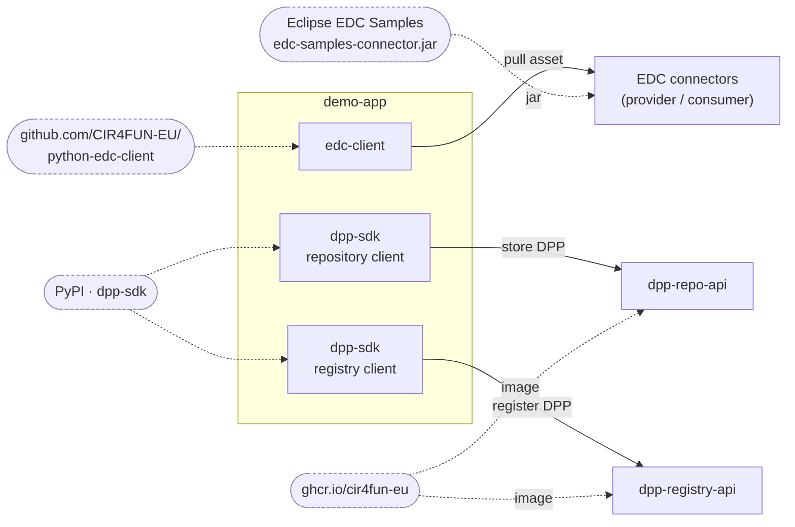

# data-space-dpp-demo

End-to-end demo of the Digital Product Passport (DPP) flow: gather product data
(baked-in demo master data plus an EDC data-space connector), assemble a
`Dpp4Fun` passport, store it in a **DPP repository**, and register it at the
**DPP registry**. Repository and registry are real running services.

Built on [`dpp-sdk`](https://pypi.org/project/dpp-sdk/) (typed models, codec,
validation, and HTTP clients).

## SDK components & where they come from

The demo app uses three pulled-in pieces: the **EDC client** and the **repository**
and **registry** clients (both from `dpp-sdk`), each talking to its running service.



## Pipeline

```
EDC asset ──► build_dpp ─► validate ─► repo.create_dpp ─► registry.post_new_dpp
```

| File | Role |
|------|------|
| `demo/connector.py` | Reads an EDC asset via `edc_client` |
| `demo/build.py` | Baked-in product data + connector links → `dpp_sdk.Dpp4Fun` |
| `demo/pipeline.py` | `run`: fetch → build → validate → store → register; `run_no_connector`: same minus the EDC fetch |
| `demo/main.py` | CLI entry (`python -m demo`) |

A reduced variant skips the data-space connector — build → validate →
store → register — via `pipeline.run_no_connector` and a second web page.

## Run (Docker, one click)

The whole demo runs as containers — repository + registry (+ their Postgres),
both EDC connectors, and the web app — from a single compose file. Safe demo
defaults are baked in, so no `.env` is needed.

**Prerequisites:** Docker + Compose. The DPP repo/registry images are public on
[GitHub Container Registry](https://github.com/orgs/CIR4FUN-EU/packages) and the
EDC client is pulled from public GitHub — nothing to log in to.

From the repo root:

```bash
# build + start everything
docker compose -f docker-compose.all.yml up -d --build
# stop
docker compose -f docker-compose.all.yml stop
# stop and delete containers + volumes
docker compose -f docker-compose.all.yml down -v
```

Then open <http://localhost:8000> and run the cards in order. Inside the stack
the services reach each other by Compose service name — nothing to configure.

Two pages are served by the same app:

| URL | Scope |
|-----|-------|
| `http://localhost:8000/` | Full pipeline (5 steps, incl. connector) |
| `http://localhost:8000/no-connector` | Reduced — no connector (4 steps) |
